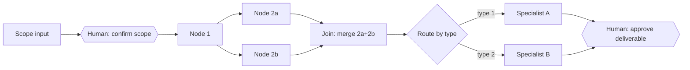

# Graph Topology Planner

Takes a scoped project and answers two connected questions: what are the actual units of
work and their dependencies, and what shape should the execution take — sequential,
parallel, routed, looped, or gated. Output is a topology plan plus a Mermaid diagram. This
skill designs the graph; it does not wire it into running subagents, Agent SDK code, or
LangGraph — that's a separate, later concern (see Downstream Handoffs).

**Not `/plan-todo`.** This skill produces a *graph* — execution shape, parallelism, and gate
placement. `/plan-todo` produces a *list* — ordered tasks read out of an existing PRD and TDD.
"What runs in parallel, and where do I need to approve?" is this skill. "What do I work on
next?" is `/plan-todo`. When a project needs both, this one runs first and feeds it.

Grounded in Anthropic's five composable agent patterns — chaining, routing,
parallelization, orchestrator-workers, evaluator-optimizer (see "Building Effective
Agents") — plus explicit human-gate design layered on top, since none of the five patterns
natively encode when a human needs to approve before the graph proceeds.

---

## Step 0 — Check Entry Point

Determine where the project stands before decomposing:

| State | Action |
|---|---|
| Fuzzy problem, the set of options is still open — no chosen direction yet | Hand off to `/brainstorm-ideas` first. Return here once it produces a Recommendation block. |
| A single direction is already chosen but vague on problem, user, or scope | Hand off to `/interrogate-me` first — it sharpens one idea into a Concept Brief. Return here once the brief exists. Do **not** route this case to `/brainstorm-ideas`; there is nothing left to diverge on. |
| Objective, constraints, and deliverable are already clear (from a brainstorm Recommendation, an `/interrogate-me` Concept Brief, a client brief, or a spec) | Proceed to Step 1 directly. |

If genuinely unsure which state applies, ask **one** clarifying question rather than
guessing at scope.

---

## Step 1 — Decompose into Work Units (Nodes)

Break the project into discrete units of work. For each unit capture:

- **Name** — short, verb-first (e.g., "Run short-circuit analysis," not "Short-circuit")
- **Input** — what it needs before it can start
- **Output** — what it produces
- **Depends on** — which other units must complete first (empty if none)

Aim for MECE-ish coverage — no unit should silently contain two unrelated jobs, and
nothing load-bearing should be left off the list. This is a raw dependency list, not yet a
topology — resist the urge to decide execution shape here.

For always-on / event-driven work (a pipeline triggered by new data rather than a single
request), also capture **Idempotent: yes/no** per node — see
`references/examples.md` for why this matters more than routing logic in that case.

---

## Step 2 — Identify Human Gates

For each node or transition, check whether it needs a human checkpoint before the graph
proceeds. A gate is warranted when at least one is true:

- **Irreversible or costly to undo** once the next node consumes the output
- **Carries external weight** — legal, financial, safety, or reputational (a PE stamp, a
  client-facing deliverable, a spend commitment, anything that goes out under your name)
- **Genuine ambiguity** — multiple valid paths exist and only the human has the missing
  context or authority to pick
- **Low trust threshold** — new domain, first time doing this exact task, or a track
  record of errors at this step

Mark each qualifying transition as a **Gate**. Don't gate everything — a gate at every edge
just rebuilds a fully manual process with extra steps. Gate the transitions where being
wrong is expensive; let the rest run.

This list is independent of topology — you're marking *where* a pause belongs, not yet
*how* the surrounding work executes.

---

## Step 3 — Select Topology per Cluster

Group the nodes from Step 1 into clusters that share an execution shape, and assign a
pattern to each cluster. A project usually mixes patterns — a sequential backbone with one
parallel cluster embedded in it is normal, not a compromise.

| Pattern | Structure | Use when | Failure mode if misapplied |
|---|---|---|---|
| **Chaining** | A→B→C, each stage's output becomes the next stage's input | Steps have a real dependency order — B is meaningless without A's result | Forcing independent work into a chain adds latency for no benefit |
| **Routing** | Classifier node inspects input, dispatches to exactly one specialized path | Inputs vary in kind and each kind needs genuinely different handling | Using a router when all paths converge on the same logic anyway — just adds an unneeded branch |
| **Parallelization — Sectioning** | Fixed decomposition, N independent subtasks run at once, results combined | Subtasks don't depend on each other and the split is known in advance | Sectioning tasks that actually share state — race conditions on the shared output |
| **Parallelization — Voting** | Same task run N times (different angles/models/temperatures), results aggregated or majority-checked | Confidence matters more than speed and you want independent cross-checks | Voting on a task with one objectively correct answer — expensive theater |
| **Orchestrator-Workers** | A lead node dynamically decides what work is needed and spins up workers for it | The subtask breakdown can't be fixed in advance — it depends on what the lead node finds | Using this when the breakdown is actually static — adds an orchestration node with nothing left to decide |
| **Evaluator-Optimizer** | Generate → critique → revise, capped iterations | Quality is genuinely improvable by a real check, not just "looks good to me" | No cap on iterations, or the "evaluator" isn't actually independent of the generator's blind spots |

For each cluster, name the pattern chosen and give one sentence of rationale — same
traceability standard as `brainstorm-ideas`' methodology citations. If you can't justify
the pattern in one sentence, it's probably the wrong one.

---

## Step 4 — Merge Gates into the Topology

Overlay the Step 2 gate list onto the Step 3 topology. A gate sits *on an edge*, not
inside a node — it interrupts the transition between two units of work, it doesn't
replace either one.

Two things to check here, since they're where silent bugs hide:

- **Fan-in reducers.** Any point where parallel branches (Sectioning, Voting, or
  Orchestrator-Workers) rejoin needs an explicit merge rule decided now: overwrite,
  append, majority vote, structured merge, or block until a human resolves a conflict.
  Don't leave this implicit — "figure it out later" is how two branches silently
  overwrite each other's output.
- **Gate placement on loops.** If an Evaluator-Optimizer loop is capped, decide whether
  hitting the cap is itself a gate (human reviews why it didn't converge) or a silent
  fallback.

---

## Step 5 — Render the Graph

Produce a Mermaid flowchart. Conventions to keep consistent across plans:

- Work units: `A[Task name]`
- Router/decision nodes: `B{Route by X}`
- Human gates: `C{{Human: approve?}}` — hexagon, visually distinct from a routing decision
- Parallel branches: fan out from one node into several, fan back into a join node
- Loop-back edges (Evaluator-Optimizer): labeled `-->|revise|` back to the generator node



Render this as a `.mermaid` artifact rather than a plain fenced block when the artifact
tool is available — it's structured reference content worth keeping and reusing, not a
throwaway diagram.

---

## Output Format

```
## Project
[One-line scope statement]

## Nodes
| Node | Input | Output | Depends on |
|---|---|---|---|

## Gates
| Transition | Why it's gated |
|---|---|

## Topology
| Cluster | Pattern | Rationale |
|---|---|---|

## Reducer Notes
[For each fan-in point: merge rule]

## Graph
[Mermaid diagram — as artifact if available]
```

---

## Downstream Handoffs

This skill stops at the design stage — it doesn't wire subagents, write Agent SDK code, or
configure LangGraph. Where the plan goes next depends on the project type; offer, don't
auto-run:

**Position in the pipeline.** For a coding project this skill runs **after** `/prd-tdd-writer`
— the TDD decides the architecture the topology has to respect, so designing the graph first
means redrawing it once the stack lands. For a non-code deliverable (consulting SOW,
recurring workflow, ops pipeline) there is no TDD and this skill runs **instead of** it, with
the Output Format block standing in as the scope document.

| Project type | Hand off to |
|---|---|
| Coding project, no PRD/TDD yet | `/prd-tdd-writer` first — carry the Nodes table in as scope input, then return here to design the graph against the chosen architecture |
| Coding project, PRD + TDD already exist | `/plan-todo` — it reads the PRD and TDD as its source of truth; supply the Nodes table and Topology block as supplementary ordering input, not as a replacement for those docs |
| Consulting/engineering deliverable (SOW, spec) | `docx` skill — the Output Format block becomes the scope section |
| Needs actual multi-agent execution, not just a plan | Flag explicitly that implementation (subagent definitions, orchestrator routing code) is a separate, later step — don't build it here even if asked to extend scope mid-skill |
| Recurring workflow (content, reporting) | Reminders or a checklist — no code needed, the topology plan itself is the artifact |
| Client-facing or presentation deliverable (not staying in a git repo next to code) | `diagram-toolkit`'s `render_flowchart.py` — map the Nodes table to `nodes`/`edges`, Topology clusters to `lanes` (one per worker/actor), Gates to a `decision` shape or a dedicated "Human" lane, and any Evaluator-Optimizer revise loop to an `edge.loop: true`. The Mermaid diagram from Step 5 stays the dev-facing version; this is the polished-SVG version of the same graph, not a replacement |

---

## Reference Files

| File | Contents | Load When |
|---|---|---|
| `references/examples.md` | Worked topology plans across domains — engineering/consulting, multi-agent tooling, content pipelines, event-driven systems, business/strategy work | When an unfamiliar domain makes the pattern table hard to apply directly, or to sanity-check a plan before finalizing |
